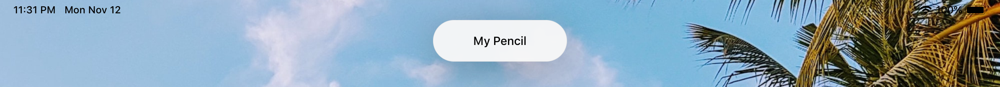
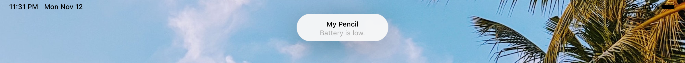
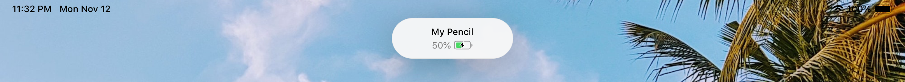

# 🍪 BisKit

BisKit is an iOS library to generate beautiful popups as the one featured when Apple Pencil is attached to the new iPad Pro.

 

...but you can also add other elements, that will be shown after the first animation. We call them _toppings_!

## Requirements

- Xcode 10 and later
- iOS 12 and later
- Swift 4.2 and later

## Installation

### Carthage

To install BisKit through Carthage, simply add this line to your `Cartfile`:

```
github "ho0t/BisKit"
```

### CocoaPods

To install BisKit through CocoaPods, simply add this line to your `Podfile`:

```
pod 'BisKit'
```

## Usage

### Basic

 

To open a new `Biscuit`, create a new instance of `BiscuitViewController` and present it as a usual view controller:

```
let biscuit = BiscuitViewController(title: "My Pencil", timeout: 1.5)
self.present(biscuit, animated: true, completion: nil)
```

### Add toppings 🍬

If you want to add one or more toppings, create a new instance of `BiscuitViewController` by passing an array of `UIView`s into the initializers and present it as a usual view controller.

#### Built-in toppings

##### Label

 

```
let label = ToppingLabel(text: "Battery is low.")
let biscuit = BiscuitViewController(title: "My Pencil", timeout: 1.5)
self.present(biscuit, animated: true, completion: nil)
```

##### Battery

 

```
let percentage = ToppingLabel(level: 0.5, batteryState: .charging) 
let biscuit = BiscuitViewController(title: "My Pencil", timeout: 1.5)
self.present(biscuit, animated: true, completion: nil)
```

## TODO

While the library is working, there are still some tasks to do, like:

- Writing tests
- Fix minor UI issues
- Create other built-in toppings
- etc.

If you would like to contribute to this project, feel free to do it: your help will be really appreciated! 😉

## License

This open source component is released under [MIT License](https://github.com/ho0t/BisKit/blob/master/LICENSE).

## Authors

[Nicola Giancecchi](https://github.com/nicorsm) ([Twitter](https://www.twitter.com/nicorsm)) and [Giovanni Filaferro](https://github.com/fila95) ([Twitter](https://www.twitter.com/fila95)).